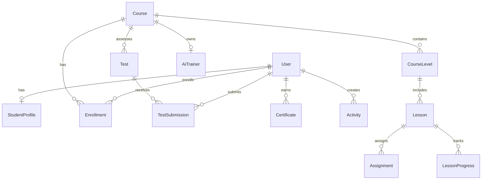

# ER Diagram

```mermaid
erDiagram
  User ||--o| StudentProfile : has
  User ||--o{ Enrollment : enrolls
  User ||--o{ TestSubmission : submits
  User ||--o{ Certificate : earns
  User ||--o{ Activity : creates
  Course ||--o{ CourseLevel : contains
  Course ||--o| AiTrainer : owns
  Course ||--o{ Enrollment : has
  Course ||--o{ Test : assesses
  CourseLevel ||--o{ Lesson : includes
  Lesson ||--o{ Assignment : assigns
  Lesson ||--o{ LessonProgress : tracks
  Test ||--o{ TestSubmission : receives
```
